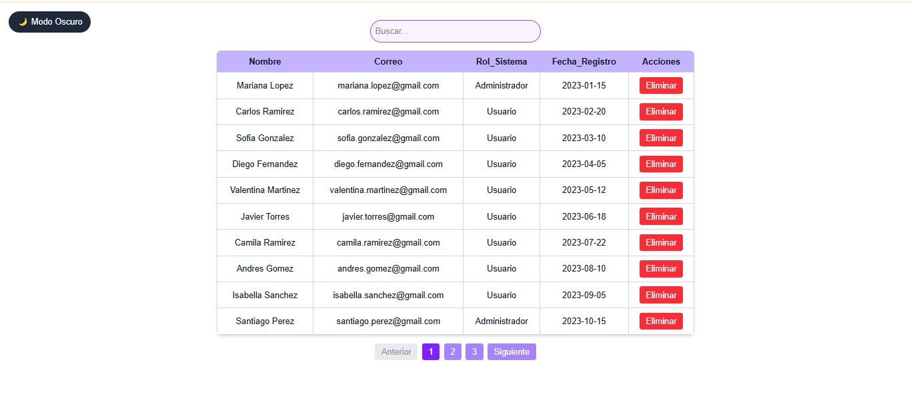

# Proyecto - Creación de una Tabla de Datos Dinamica

Desarrollar un componente en React reutilizable que permita visualizar,buscar, ordenar, paginar y eliminar registros de una lista de usuarios, permitiendo ordenar y gestionar datos.

## Tecnologias utilizadas 
* React
* Next.js
* TypeScript
* TailwindCSS

[Proyecto Desplegado(https://tabla-dinamica.vercel.app/)](https://tabla-dinamica.vercel.app/)

